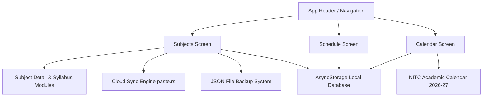

<div align="center">

# 🫪 ColAsi

### *Cozy Bunk Policy, Timetable & Syllabus Tracker for NIT Calicut*

[](https://expo.dev)
[](https://reactnative.dev)
[](https://expo.dev)
[](https://nitc.ac.in)
[](https://github.com/Anush-Kashyap)

<p align="center">
  A sleek, dark-themed mobile application engineered for NIT Calicut students to track attendance limits, organize daily schedules, monitor syllabus module progress, and sync data across devices effortlessly.
</p>

---

</div>

## ✨ Key Features

### 📊 Smart Attendance & Bunk Policy Engine
- **Strict 20% Bunk Control**: Real-time calculation of safe bunks remaining per subject before hitting attendance shortage limits.
- **Visual Progress Rings**: Color-coded attendance progress metrics for quick status checks.

### 📖 Modular Syllabus & Catalog Tracker
- **Module Toggle Cards**: Expandable `Open ▼` / `Close ▲` module accordions to check off topics covered in class vs. self-study.
- **Subject Detail Inspector**: Deep dive into individual course progress, credits, and topic breakdowns.

### 🗓️ Official NIT Calicut Academic Calendar 2026-27
- **Pre-Loaded Holidays & Exams**: Includes Mid-Semesters, End-Semesters, Onam, Dussehra, and Deepavali.
- **Special Schedule Rules**:
  - 🏛️ **Institute Foundation Day (Sept 1)**: Configured as an active instructional working day.
  - 📅 **Friday Schedule Override (Nov 5)**: Automatically loads Friday timetable sessions on Nov 5 per official NITC guidelines.

### ☁️ Free 5-Character Cloud Sync & Local Backups
- **⚡ 5-Character Cloud Sync**: Instant device-to-device data transfer using temporary 5-letter codes (e.g. `K9A68`) valid for 1 hour — no accounts or signups required.
- **📁 `.json` File Backup**: Save and restore full database backups to phone storage or Drive with 0 character limits.

---

## 📱 User Interface & Aesthetics

ColAsi uses a warm, cozy dark mode palette tailored for high readability and visual contrast.

| Palette Element | Color Hex | Role |
| :--- | :--- | :--- |
| **Background Dark** | `#161412` | Primary screen canvas |
| **Card Surface** | `#221F1C` | Elevated UI cards & modals |
| **Cream Text** | `#F4EFEA` | High contrast primary typography |
| **Warm Gold** | `#ECC875` | Accent highlights & call-to-action badges |

---

## 🏗️ Architecture Overview



---

## 🚀 Getting Started

### Prerequisites
- [Node.js](https://nodejs.org/) (v18 or higher)
- [Expo Go](https://expo.dev/client) app installed on your **Android** or **iOS** device.

### Installation

1. **Clone the Repository**
   ```bash
   git clone https://github.com/Anush-Kashyap/ColAsi.git
   cd ColAsi
   ```

2. **Install Dependencies**
   ```bash
   npm install
   ```

3. **Start Expo Development Server**
   ```bash
   npx expo start
   ```

4. **Run on Device**
   - **Android**: Scan the generated QR code using the Expo Go app.
   - **iOS**: Scan the QR code using your iPhone Camera app to launch Expo Go.

---

## 🛠️ Tech Stack

- **Framework**: [React Native](https://reactnative.dev) / [Expo SDK 54](https://docs.expo.dev/versions/v57.0.0/)
- **State & Storage**: `@react-native-async-storage/async-storage`
- **File System & Sharing**: `expo-file-system`, `expo-sharing`, `expo-document-picker`
- **UI Components**: `react-native-calendars`, `expo-clipboard`
- **Cloud Gateway**: REST API via `fetch()` (No API keys required)

---

## 👤 Author & Credits

Designed and developed with ❤️ for NIT Calicut students by **Anush 🫪**.

- **GitHub**: [@Anush-Kashyap](https://github.com/Anush-Kashyap)
- **Repository**: [ColAsi GitHub Repository](https://github.com/Anush-Kashyap/ColAsi)

---

<div align="center">
  <sub>Built for students • Made by Anush 🫪 • NIT Calicut 2026-27</sub>
</div>
